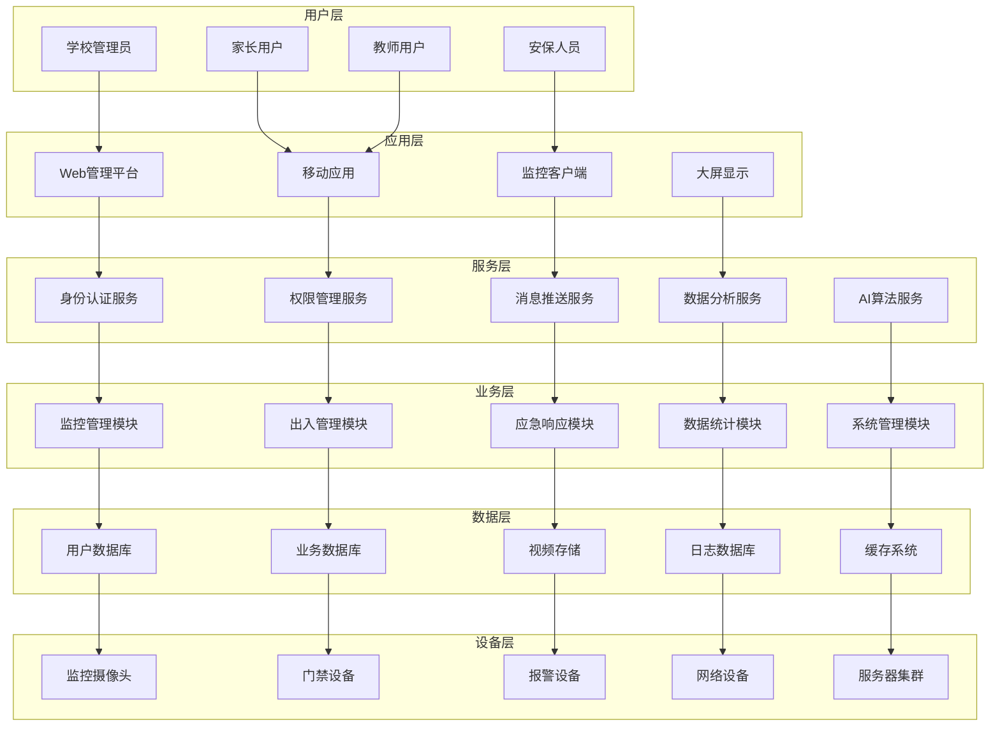

# 校园周边安全保障系统技术总体设计方案

本方案旨在为“校园周边安全保障系统”的建设提供一套全面、先进且可行的技术框架。方案将从系统总体架构、技术选型与标准、以及系统性能与可靠性等多个维度进行详细阐述，以确保系统建设的科学性、前瞻性和实用性，为打造安全、智能、高效的校园安防环境奠定坚实的技术基础。

## 1. 系统总体架构设计

系统总体架构是整个项目的骨架，决定了系统的可扩展性、稳定性和可维护性。本设计从技术架构、网络架构和安全架构三个层面入手，构建一个分层解耦、安全可靠、易于扩展的现代化安防体系。

### 1.1 技术架构设计

本系统采用先进的分层架构模型，将复杂的系统划分为职责清晰的多个层次。这种设计不仅降低了各层之间的耦合度，也极大地提升了系统开发的灵活性和维护效率。每一层都专注于自身的核心功能，通过标准化的接口与相邻层进行通信协作。

#### 分层架构模型

下图清晰地展示了从底层硬件设备到顶层用户交互的六个核心层次，分别是设备层、数据层、业务层、服务层、应用层和用户层。这种结构确保了数据流和控制流的有序传递，为上层应用提供稳定可靠的基础支撑。



#### 架构设计原则

为了确保上述架构能够成功实施并发挥最大效能，我们遵循以下核心设计原则：

- **分层解耦**：各层职责清晰，层间通过接口调用，降低系统复杂度，便于独立开发和维护。
- **服务化**：采用微服务架构，将核心功能封装成独立服务，提高系统内聚性和可扩展性。
- **标准化**：遵循行业和国家标准进行设计与开发，确保系统具备良好的兼容性和互操作性。
- **模块化**：功能模块高度独立，支持即插即用，便于未来按需进行功能升级或替换。
- **高可用**：关键组件和服务采用冗余设计和集群部署，确保系统7x24小时稳定运行。
- **可扩展**：在系统设计之初便预留扩展接口，能够灵活支持未来的功能扩展和性能提升。

### 1.2 网络架构设计

网络是系统的“血脉”，其稳定性和性能直接影响整个系统的表现。本方案设计的网络架构旨在为海量视频数据、控制信令和业务数据提供一个高可靠、高性能、高安全的传输通道。

#### 网络拓扑结构

网络拓扑结构采用分区设计，将不同业务流量进行物理或逻辑隔离，防止安全风险扩散和网络拥塞。拓扑图清晰地展示了从外网接入到内部各业务网络（业务、监控、门禁）的层级关系和数据流向。

代码段

```
graph TB
    subgraph "外网接入"
        Internet[互联网]
        ISP[运营商专线]
    end

    subgraph "网络安全区"
        FW[防火墙]
        IDS[入侵检测]
        VPN[VPN网关]
    end

    subgraph "核心网络"
        CoreSwitch[核心交换机]
        BackupSwitch[备份交换机]
    end

    subgraph "业务网络"
        WebServer[Web服务器]
        AppServer[应用服务器]
        DBServer[数据库服务器]
        StorageServer[存储服务器]
    end

    subgraph "监控网络"
        MonitorSwitch[监控交换机]
        NVR[网络录像机]
        Camera1[摄像头群组1]
        Camera2[摄像头群组2]
        CameraN[摄像头群组N]
    end

    subgraph "门禁网络"
        AccessSwitch[门禁交换机]
        AccessController[门禁控制器]
        Reader1[读卡器群组1]
        Reader2[读卡器群组2]
    end

    Internet --> ISP
    ISP --> FW
    FW --> IDS
    IDS --> VPN
    VPN --> CoreSwitch
    CoreSwitch --> BackupSwitch

    CoreSwitch --> WebServer
    CoreSwitch --> AppServer
    CoreSwitch --> DBServer
    CoreSwitch --> StorageServer

    CoreSwitch --> MonitorSwitch
    MonitorSwitch --> NVR
    MonitorSwitch --> Camera1
    MonitorSwitch --> Camera2
    MonitorSwitch --> CameraN

    CoreSwitch --> AccessSwitch
    AccessSwitch --> AccessController
    AccessController --> Reader1
    AccessController --> Reader2
```

#### 网络设计原则

网络建设将严格遵循以下原则，以打造一个健壮、高效的承载网络：

- **高可靠性**：核心交换设备采用冗余热备，关键链路进行捆绑备份，避免单点故障。
- **高性能**：骨干网络采用千兆带宽，核心上联采用万兆带宽，充分满足高清视频流等大数据量传输需求。
- **安全性**：部署防火墙、入侵检测系统构建多层安全防线，对不同业务区域进行网络隔离，并实施严格的访问控制策略。
- **可扩展性**：网络设备预留充足的扩展端口和性能余量，能够平滑支持未来业务增长带来的网络扩容需求。
- **标准化**：采用TCP/IP等国际标准协议，确保不同厂商设备的兼容性和互联互通。
- **易管理**：通过网络管理平台实现对全网设备的集中管理、统一配置和状态监控，简化运维工作。

### 1.3 安全架构设计

安全是校园安防系统的基石。本方案构建了一个“纵深防御、全面覆盖”的立体式安全防护体系，旨在保护系统免受来自物理、网络、系统、应用、数据和管理等各个层面的威胁。

#### 安全防护体系

该体系将安全防护措施贯穿于系统建设和运行的全过程，从机房的物理安全到人员的安全管理，层层设防，确保系统整体的安全性。

代码段

```
graph TB
    subgraph "物理安全"
        A1[机房安全]
        A2[设备防护]
        A3[环境监控]
        A4[访问控制]
    end

    subgraph "网络安全"
        B1[防火墙]
        B2[入侵检测]
        B3[VPN隧道]
        B4[网络隔离]
        B5[流量监控]
    end

    subgraph "系统安全"
        C1[操作系统加固]
        C2[补丁管理]
        C3[病毒防护]
        C4[系统监控]
        C5[日志审计]
    end

    subgraph "应用安全"
        D1[身份认证]
        D2[权限控制]
        D3[数据加密]
        D4[安全编码]
        D5[漏洞扫描]
    end

    subgraph "数据安全"
        E1[数据分类]
        E2[加密存储]
        E3[传输加密]
        E4[备份恢复]
        E5[销毁管理]
    end

    subgraph "管理安全"
        F1[安全策略]
        F2[安全培训]
        F3[应急预案]
        F4[风险评估]
        F5[合规检查]
    end

    A1 --> B1
    A2 --> B2
    A3 --> B3
    A4 --> B4

    B1 --> C1
    B2 --> C2
    B3 --> C3
    B4 --> C4
    B5 --> C5

    C1 --> D1
    C2 --> D2
    C3 --> D3
    C4 --> D4
    C5 --> D5

    D1 --> E1
    D2 --> E2
    D3 --> E3
    D4 --> E4
    D5 --> E5

    E1 --> F1
    E2 --> F2
    E3 --> F3
    E4 --> F4
    E5 --> F5
```

#### 安全等级保护要求

为满足国家法律法规和行业监管要求，系统将严格遵循以下安全建设要求：

- **等保级别**：系统整体将按照《网络安全等级保护基本要求》**三级**标准进行规划、设计和建设。
- **安全域划分**：根据业务重要性和安全需求，将网络划分为核心区、业务区、监控区、管理区等不同的安全域，并实施严格的隔离和访问控制。
- **访问控制**：采用基于角色的访问控制（RBAC）模型，对用户权限进行精细化管理，确保其只能访问授权的资源。
- **审计监控**：建立全面的安全审计和监控机制，对所有用户的关键操作和系统异常事件进行记录和告警。
- **数据保护**：对用户的个人信息、设备口令等敏感数据，在存储和传输过程中均采用高强度加密算法进行保护。
- **应急响应**：建立完善的安全事件应急响应预案和处理流程，确保在安全事件发生时能够快速响应、有效处置，将损失降到最低。

## 2. 技术方案选型和标准规范

技术选型和标准规范是项目成功实施的保证。本章将明确系统所采用的核心软硬件技术、遵循的国家及行业标准，以及系统间的集成方案，为后续的开发、采购和集成工作提供清晰的指引。

### 2.1 核心技术选型

技术的选型综合考虑了成熟度、性能、社区生态、可维护性及未来发展趋势，旨在为系统构建一个稳定、高效、易于扩展的技术基座。

#### 软件技术栈

下表列出了系统在开发过程中所依赖的关键软件技术及其选型理由。

|   |   |   |   |
|---|---|---|---|
|**技术领域**|**选型方案**|**版本**|**选择理由**|
|后端框架|Spring Boot|2.7.x|技术成熟稳定，拥有庞大的开发者社区和丰富的生态系统，能显著提高开发效率。|
|数据库|MySQL|8.0.x|开源关系型数据库的领导者，性能优秀，运行稳定可靠，社区支持活跃。|
|缓存|Redis|6.2.x|业界领先的高性能键值数据库，支持多种数据结构，能有效缓解数据库压力。|
|消息队列|RabbitMQ|3.9.x|成熟可靠的消息中间件，功能丰富，支持多种消息模式，适用于系统解耦和异步处理。|
|前端框架|Vue.js|3.x|主流前端框架之一，学习曲线平缓，采用组件化开发模式，开发体验好。|
|UI组件库|Element Plus|2.x|基于Vue 3的组件库，提供丰富、美观、高质量的UI组件，加速前端页面开发。|
|移动端|Flutter|3.x|Google推出的跨平台UI框架，一套代码可同时构建Android和iOS应用，性能接近原生。|
|视频编码|H.265/HEVC|-|新一代视频编码标准，相比H.264，在同等画质下压缩率更高，能有效节省存储成本和网络带宽。|
|AI算法|TensorFlow|2.x|Google开源的深度学习框架，功能强大，生态完善，社区支持良好，适合复杂的AI模型开发。|
|容器化|Docker|20.x|应用最广泛的容器化技术，实现环境标准化，简化部署流程，提升交付效率。|
|容器编排|Kubernetes|1.24.x|容器编排领域的事实标准，能实现应用的自动化部署、弹性伸缩和故障自愈。|
|监控工具|Prometheus|2.x|开源的系统监控和告警工具集，基于时序数据库，具备强大的监控和查询能力。|

#### 硬件设备技术规格

为保证系统功能的实现和性能的稳定，关键硬件设备需满足以下技术规格要求。

**监控设备技术要求**

|   |   |   |
|---|---|---|
|**设备类型**|**技术参数**|**性能指标**|
|高清网络摄像头|800万像素，4K分辨率|红外距离≥80米，低照度≤0.01Lux|
|智能球机|200万像素，光学变焦≥30倍|红外距离≥150米，转速≥300°/s|
|人脸识别摄像头|200万像素，内嵌人脸识别算法|识别准确率≥99.5%，识别距离0.5-8米|
|网络录像机|支持≥64路，4K录制|存储容量≥48TB，支持RAID5/6|

**服务器设备技术要求**

|   |   |   |
|---|---|---|
|**设备类型**|**配置要求**|**性能指标**|
|应用服务器|双路CPU，≥64GB内存|处理器主频≥2.4GHz，采用SSD存储|
|数据库服务器|双路CPU，≥128GB内存|采用高性能SSD，配置RAID10阵列|
|存储服务器|大容量存储，≥32GB内存|存储总容量≥96TB，支持磁盘热插拔|
|AI计算服务器|配置专业GPU，≥256GB内存|单卡GPU显存≥16GB，支持CUDA|

**网络设备技术要求**

|   |   |   |
|---|---|---|
|**设备类型**|**技术参数**|**性能指标**|
|核心交换机|≥48个千兆电口，≥4个万兆光口|交换容量≥500Gbps，包转发率≥300Mpps|
|接入交换机|≥24个千兆POE电口|POE总功率≥370W，支持POE+标准|
|防火墙|网络吞吐量≥10Gbps|并发连接数≥500万，支持VPN隧道≥1000条|
|无线控制器|支持管理≥512个AP|并发用户数≥10000，漫游切换时间≤50ms|

### 2.2 标准规范体系

系统的建设必须严格遵守相关的国家和行业标准，这不仅是合规性的基本要求，也是确保系统质量、兼容性和互操作性的重要前提。

#### 国家标准

- **GB/T 28181-2016**：公共安全视频监控联网系统信息传输、交换、控制技术要求
- **GB 50348-2018**：安全防范工程技术标准
- **GB/T 22239-2019**：信息安全技术 网络安全等级保护基本要求
- **GB/T 35273-2020**：信息安全技术 个人信息安全规范
- **GB/T 20269-2006**：信息安全技术 信息系统安全管理要求
- **GB/T 25070-2019**：信息安全技术 网络安全等级保护安全设计技术要求

#### 行业标准

- **GA/T 1400.1-2017**：公安视频图像信息应用系统 第1部分：通用技术要求
- **GA/T 1400.2-2017**：公安视频图像信息应用系统 第2部分：应用平台技术要求
- **JGJ/T 16-2008**：民用建筑电气设计规范
- **YD/T 926.1-2009**：大楼通信综合布线系统
- **GA/T 75-1994**：安全防范工程程序与要求

#### 技术规范要求

为了量化系统的建设质量，各核心子系统需满足以下关键技术指标。

**视频监控系统技术指标**：

- 图像分辨率：关键区域不低于1920×1080（200万像素）。
- 帧率：实时监控不低于25fps，录像存储不低于15fps。
- 压缩标准：优先采用H.265/H.265+智能编码。
- 存储时间：普通区域录像不低于30天，重要区域不低于90天。
- 网络协议：必须支持GB/T 28181标准，兼容ONVIF协议。
- 图像质量：信噪比不低于50dB，宽动态范围不低于120dB。

**人脸识别系统技术指标**：

- 识别准确率：1:1比对场景不低于99.5%，1:N识别场景不低于99.0%。
- 识别速度：单人识别时间不超过1秒。
- 人脸库容量：支持不低于10万张人脸底库，并支持动态扩展。
- 活体检测：必须支持，防伪攻击准确率不低于99%。
- 识别距离：支持0.5-8米范围，最佳识别距离为1.5-3米。
- 角度适应：允许人脸在水平±30°、垂直±20°范围内转动。

**网络系统技术指标**：

- 核心网络：采用千兆以太网技术，具备万兆上联能力。
- 接入网络：实现千兆到桌面，并为前端设备提供POE供电。
- 无线网络：覆盖区域采用WiFi 6标准，支持双频并发。
- 网络协议：全面支持TCP/IP协议栈，支持SNMP v3、HTTP/HTTPS等。
- 网络延迟：局域网内部端到端延迟不超过10ms。
- 带宽利用率：正常运行时，主干链路带宽利用率不超过80%。

### 2.3 系统集成方案

本系统作为一个综合性的安防平台，需要与校园内已有的以及未来可能建设的各类子系统进行高效集成，实现数据互通和业务联动。

#### 集成架构设计

集成架构以“核心安全平台”为中心，通过标准化的接口与视频监控、门禁、报警等安防子系统以及短信、微信等通信系统进行对接。同时，预留与上级公安、教育等外部系统的数据共享接口。

代码段

```
graph TB
    subgraph "校园安全系统"
        Core[核心安全平台]
    end

    subgraph "视频监控系统"
        Video[视频管理平台]
        NVR[网络录像机]
        Camera[监控摄像头]
    end

    subgraph "门禁管理系统"
        Access[门禁管理平台]
        Controller[门禁控制器]
        Reader[读卡器设备]
    end

    subgraph "报警系统"
        Alarm[报警管理平台]
        Sensor[传感器设备]
        Speaker[语音设备]
    end

    subgraph "通信系统"
        SMS[短信平台]
        Email[邮件系统]
        Push[推送服务]
        WeChat[微信接口]
    end

    subgraph "外部系统"
        Police[公安系统]
        Education[教育局系统]
        Parent[家长端应用]
        School[学校管理系统]
    end

    Core --> Video
    Core --> Access
    Core --> Alarm
    Core --> SMS

    Video --> NVR
    NVR --> Camera

    Access --> Controller
    Controller --> Reader

    Alarm --> Sensor
    Alarm --> Speaker

    SMS --> Email
    Email --> Push
    Push --> WeChat

    Core --> Police
    Core --> Education
    Core --> Parent
    Core --> School
```

#### 接口标准规范

为实现不同系统间的顺畅对接，所有接口需遵循统一的标准规范：

- **视频接口**：优先采用GB/T 28181，兼容ONVIF、RTSP/RTP，前端展示采用WebRTC。
- **门禁接口**：设备层采用Wiegand、RS485，平台层采用TCP/IP或HTTP API。
- **数据接口**：主要采用RESTful API风格，对实时性要求高的场景使用WebSocket。
- **消息接口**：系统内部采用MQTT或AMQP，对外推送采用HTTP或WebSocket。
- **认证接口**：支持OAuth 2.0、SAML 2.0等标准认证协议，便于与第三方系统单点登录。
- **数据格式**：接口数据交换统一使用JSON格式，特定场景可使用XML或Protocol Buffers。

#### 集成技术方案

为保障集成工作的顺利进行，将采用以下关键技术方案：

API网关设计：

- 建立统一的API网关，作为所有服务接口的唯一入口。
- 实现请求的统一路由、身份认证、权限控制和日志记录。
- 提供请求限流和熔断保护机制，保障后端服务的稳定性。

**数据同步机制**：

- 对实时性要求高的数据（如告警），通过WebSocket或消息队列进行实时同步。
- 对批量数据，通过ETL工具或定时任务进行定期同步。
- 采用增量同步机制，减少数据传输量，保证数据一致性。

**服务治理**：

- 引入服务注册与发现中心（如Nacos、Consul），实现服务的自动注册和发现。
- 在API网关和服务间调用层面实现负载均衡和故障转移。
- 建立服务健康检查机制，对异常服务进行自动隔离和恢复。

## 3. 系统性能与可靠性设计

性能和可靠性是衡量一个系统优劣的关键指标。本方案从性能指标定义和高可用设计两方面入手，确保系统能够在大并发、大数据量场景下持续稳定地提供服务。

### 3.1 性能设计指标

本节定义了系统需要达到的关键性能目标，并提出了相应的优化策略，以指导后续的性能测试和调优工作。

#### 系统性能要求

|   |   |   |
|---|---|---|
|**性能指标**|**目标值**|**测试方法**|
|并发用户数|≥1000|通过负载测试工具（如JMeter）模拟用户并发访问。|
|响应时间|核心操作平均响应时间 ≤3秒|在并发压力下，记录并分析服务器端处理时间。|
|系统可用性|≥99.9%|通过持续监控计算（(总时长-故障时长)/总时长）。|
|数据处理能力|≥10000 TPS（每秒事务数）|针对核心数据写入接口进行性能基准测试。|
|视频延迟|实时视频端到端延迟 ≤500ms|测量从摄像头采集到客户端显示的延迟。|
|存储容量|≥100TB，并支持在线扩展|进行存储容量规划和压力测试。|

#### 性能优化策略

为达成上述性能目标，将从数据库、缓存、网络等多个层面实施综合优化策略。

数据库优化：

- **读写分离**：采用主从复制架构，将读操作和写操作分离到不同数据库服务器，分担主库压力。
- **分库分表**：对用户数据、业务日志等海量数据表进行水平或垂直拆分。
- **索引优化**：为高频查询字段建立合理的复合索引和覆盖索引。
- **查询优化**：定期分析慢查询日志，优化SQL语句和执行计划。

**缓存策略**：

- **多级缓存**：构建浏览器缓存、CDN缓存、应用层分布式缓存（Redis）等多级缓存体系。
- **缓存更新**：采用合理的缓存失效与更新策略（如主动更新、被动失效）。
- **缓存穿透/雪崩**：利用布隆过滤器防止缓存穿透，通过设置随机过期时间、缓存预热等手段防止缓存雪崩。

**网络优化**：

- **带宽管理**：实施QoS策略，优先保障核心业务和视频流的带宽。
- **协议优化**：应用层优先使用HTTP/2、gRPC等更高效的通信协议。
- **压缩传输**：启用Gzip等压缩算法，减少网络传输的数据量。
- **CDN加速**：将Web管理平台的静态资源（JS/CSS/图片）部署到CDN，加速用户访问。

### 3.2 可靠性设计

可靠性设计的目标是最大限度地减少系统因硬件故障、软件错误或外部灾害导致的停机时间，保障业务的连续性。

#### 高可用架构

系统将部署高可用集群架构，通过冗余和负载均衡技术，消除单点故障，实现故障的自动转移。

代码段

```
graph TB
    subgraph "负载均衡层"
        LB1[主负载均衡器]
        LB2[备负载均衡器]
    end

    subgraph "应用服务层"
        APP1[应用服务器1]
        APP2[应用服务器2]
        APP3[应用服务器3]
    end

    subgraph "数据服务层"
        DB1[主数据库]
        DB2[从数据库1]
        DB3[从数据库2]
    end

    subgraph "存储服务层"
        STORAGE1[存储节点1]
        STORAGE2[存储节点2]
        STORAGE3[存储节点3]
    end

    LB1 --> APP1
    LB1 --> APP2
    LB1 --> APP3
    LB2 --> APP1
    LB2 --> APP2
    LB2 --> APP3

    APP1 --> DB1
    APP2 --> DB2
    APP3 --> DB3

    DB1 --> DB2
    DB1 --> DB3

    APP1 --> STORAGE1
    APP2 --> STORAGE2
    APP3 --> STORAGE3
```

#### 容灾备份策略

为应对极端情况（如机房断电、自然灾害），需建立完善的数据容灾备份机制。

**数据备份**：

- **实时备份**：数据库采用主从同步机制，实现数据的实时热备份。
- **定期备份**：每日执行数据库全量备份，每小时执行增量备份。视频录像等文件采用分布式存储，并配置多副本策略。
- **异地备份**：将最核心的数据和备份文件定期传输到异地数据中心进行存储。
- **备份验证**：定期进行恢复演练，确保备份数据的可用性和有效性。

**故障恢复**：

- **自动故障转移**：当主服务器或主数据库发生故障时，系统能自动将流量切换到备用节点。
- **快速恢复**：利用系统快照、数据库备份等手段，实现系统的快速恢复。
- **数据一致性**：通过分布式事务或最终一致性方案，保证在故障切换后数据的完整性和一致性。
- **业务连续性**：在极端故障下，可启动降级服务模式，优先保障告警、监控等核心功能的运行。

通过上述完善的技术总体设计，可确保“校园周边安全保障系统”在技术上达到行业领先水平，为校园安全提供全方位、立体化、智能化的技术保障。